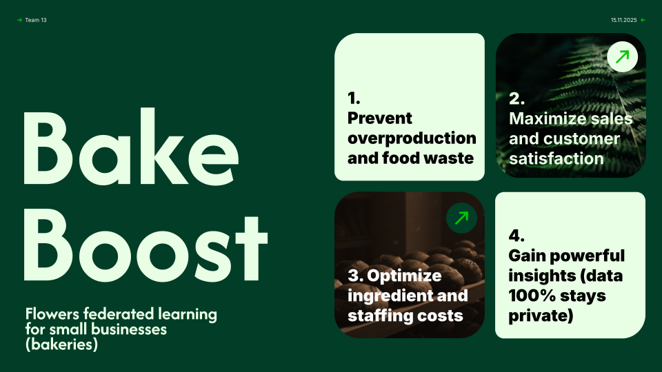

# BakeBoost 

[](https://www.python.org/downloads/)
[](https://opensource.org/licenses/MIT)


Bake Boost is the federated learning platform that lets bakeries collaborate on demand forecasting **without sharing their sensitive data**. Each bakery trains a model on their own sales history locally. These models share learnings with each other through Flower, a privacy-preserving federated framework, creating a collective intelligence.



Small bakeries face a daily dilemma: produce too much, waste food, money and labor at the end of the day. Or even produce too little and disappoint customers. Especially for small bakeries, this makes it extremely difficult to keep up with the large competition from chains. They lack the data science expertise and resources that large chains have. The result: massive food waste, higher costs, and inefficient staffing.

---

## Quick Start

### Prerequisites

- Python 3.9+ (Python 3.10+ recommended)
- Virtual environment activated

### Installation

1. **Clone and navigate to the project:**
   ```bash
   cd BakeBoost
   ```

2. **Activate virtual environment:**
   ```bash
   source venv/bin/activate
   ```

3. **Install dependencies:**
   ```bash
   pip install -r requirements.txt
   ```

### Hachathon Server Deployment
```bash
# CPU
./submit-job.sh "flwr run . cluster-cpu"

# GPU
./submit-job.sh "flwr run . cluster-gpu" --gpu

# View running jobs
squeue -u $USER

# View job output
cat ~/logs/job_*.out
```

### Run Local Simulation

Test with 5 simulated bakeries on your local machine:

```bash
flwr run . local-simulation
```


## Project Structure
```
glean/
├── glean/
│   ├── __init__.py         
│   ├── server_app.py      
│   ├── client_app.py       
│   └── task.py           
├── data/                  
├── pyproject.toml        
├── requirements.txt       
├── cluster-cpu.toml    
├── cluster-gpu.toml      
└── README.md           
```

**Built with [Flower](https://flower.ai/) - The Friendly Federated Learning Framework**
